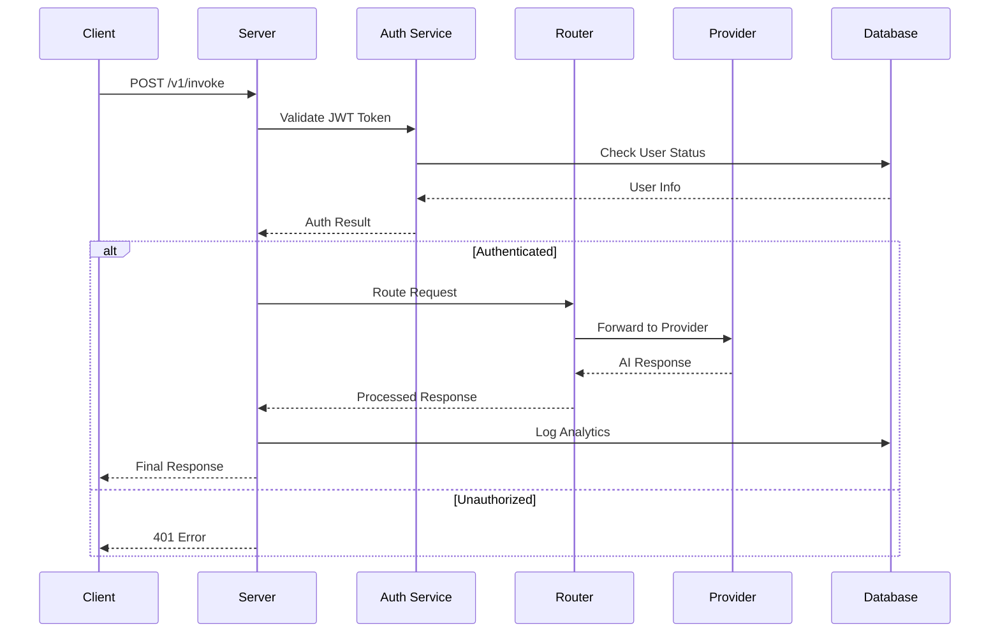

# Architecture Overview

## System Design

Rust-AI is built with a modular, service-oriented architecture that prioritizes performance, type safety, and maintainability.

```
┌─────────────────────────────────────────────────────────────┐
│                    HTTP Layer (Axum)                        │
│  ┌─────────────┐  ┌─────────────┐  ┌─────────────┐         │
│  │   CORS      │  │   Tracing   │  │  Rate Limit │         │
│  │ Middleware  │  │  Middleware │  │ Middleware  │         │
│  └─────────────┘  └─────────────┘  └─────────────┘         │
└─────────────────────────────────────────────────────────────┘
                               │
┌─────────────────────────────────────────────────────────────┐
│                    Routing Layer                            │
│  ┌─────────────┐  ┌─────────────┐  ┌─────────────┐         │
│  │    Auth     │  │    Core     │  │  Analytics  │         │
│  │  Endpoints  │  │ AI Endpoints│  │  Endpoints  │         │
│  └─────────────┘  └─────────────┘  └─────────────┘         │
└─────────────────────────────────────────────────────────────┘
                               │
┌─────────────────────────────────────────────────────────────┐
│                    Service Layer                            │
│  ┌─────────────┐  ┌─────────────┐  ┌─────────────┐         │
│  │    Auth     │  │   Search    │  │    File     │         │
│  │   Service   │  │   Service   │  │  Processor  │         │
│  └─────────────┘  └─────────────┘  └─────────────┘         │
│                                                             │
│  ┌─────────────┐  ┌─────────────┐  ┌─────────────┐         │
│  │   Convex    │  │  Provider   │  │   Config    │         │
│  │   Service   │  │   Router    │  │   Manager   │         │
│  └─────────────┘  └─────────────┘  └─────────────┘         │
└─────────────────────────────────────────────────────────────┘
                               │
┌─────────────────────────────────────────────────────────────┐
│                    Data Layer                               │
│  ┌─────────────┐  ┌─────────────┐  ┌─────────────┐         │
│  │   Convex    │  │    Redis    │  │  In-Memory  │         │
│  │  Database   │  │    Cache    │  │    Cache    │         │
│  └─────────────┘  └─────────────┘  └─────────────┘         │
└─────────────────────────────────────────────────────────────┘
                               │
┌─────────────────────────────────────────────────────────────┐
│                   External APIs                             │
│  ┌─────────────┐  ┌─────────────┐  ┌─────────────┐         │
│  │   OpenAI    │  │  Anthropic  │  │   Mistral   │         │
│  └─────────────┘  └─────────────┘  └─────────────┘         │
│  ┌─────────────┐  ┌─────────────┐  ┌─────────────┐         │
│  │ Cloudflare  │  │     XAI     │  │    Groq     │         │
│  └─────────────┘  └─────────────┘  └─────────────┘         │
│  ┌─────────────┐  ┌─────────────┐                          │
│  │ OpenRouter  │  │    Meta     │                          │
│  └─────────────┘  └─────────────┘                          │
└─────────────────────────────────────────────────────────────┘
```

## Core Components

### 1. HTTP Layer (main.rs)
- **Axum Framework**: High-performance async HTTP server
- **Middleware Stack**: CORS, tracing, rate limiting
- **Graceful Shutdown**: Signal handling for clean shutdowns
- **Error Handling**: Centralized error response formatting

### 2. Authentication System (auth.rs)
- **JWT Tokens**: Secure session management
- **Password Security**: bcrypt hashing with salt
- **Anonymous Sessions**: Guest user support with limits
- **User Management**: Registration, login, profile management

### 3. Provider Integration (routing.rs)
- **Multi-Provider Support**: 8 different AI providers
- **Request Routing**: Intelligent provider selection
- **Load Balancing**: Distribute requests across providers
- **Fallback Logic**: Handle provider failures gracefully

### 4. Data Management (convex_service.rs)
- **Database Abstraction**: Convex backend integration
- **User Persistence**: Account and session storage
- **Analytics Collection**: Usage metrics and logging
- **Event Logging**: System event tracking

### 5. Search Integration (search_service.rs)
- **Web Search**: Enhance AI responses with current data
- **Result Processing**: Clean and format search results
- **Provider Agnostic**: Support multiple search backends

### 6. File Processing (file_processor.rs)
- **Document Upload**: Handle various file formats
- **Content Extraction**: Text extraction from documents
- **Context Integration**: Include file content in AI requests

## Request Flow



## Technology Stack

### Core Dependencies
- **Axum 0.7**: Modern async web framework
- **Tokio**: Async runtime and utilities
- **Serde**: Serialization/deserialization
- **Reqwest**: HTTP client for provider APIs

### Security
- **bcrypt**: Password hashing
- **jsonwebtoken**: JWT token handling
- **validator**: Request validation

### Data & Storage
- **UUID**: Unique identifier generation
- **chrono**: Date/time handling
- **base64**: Encoding utilities

### Observability
- **tracing**: Structured logging
- **tracing-subscriber**: Log formatting

## Configuration Management

The system uses environment-based configuration with sensible defaults:

```rust
pub struct Config {
    pub bind_address: String,
    pub action_token_secret: Option<String>,
    pub clerk: ClerkConfig,
    pub convex_url: Option<String>,
    // Provider API keys...
}
```

Configuration is loaded once at startup and shared across all services via the application state.

## Error Handling Strategy

### Three-Layer Error Handling:
1. **Service Level**: Business logic errors
2. **HTTP Level**: Request/response errors  
3. **System Level**: Infrastructure errors

### Error Types:
- **Validation Errors**: Invalid input data
- **Authentication Errors**: Token/credential issues
- **Provider Errors**: External API failures
- **System Errors**: Database, network failures

## Performance Considerations

### Async Architecture
- **Non-blocking I/O**: All operations are async
- **Connection Pooling**: Reuse HTTP connections
- **Concurrent Processing**: Handle multiple requests simultaneously

### Memory Management
- **Zero-copy**: Minimize data copying where possible
- **Streaming**: Process large responses incrementally
- **Resource Cleanup**: Proper cleanup of resources

### Caching Strategy
- **In-memory**: Frequently accessed data
- **Guest Rate Limits**: Memory-based tracking
- **Configuration**: Cached at startup

## Security Architecture

### Authentication Flow
1. **User Registration**: Email/password with bcrypt
2. **Token Generation**: JWT with expiration
3. **Token Validation**: Signature verification
4. **Session Management**: Automatic token refresh

### Rate Limiting
- **Guest Users**: 5 requests/day (in-memory)
- **Registered Users**: Tier-based limits (database)
- **Abuse Prevention**: IP-based tracking

### Data Protection
- **Password Security**: bcrypt with salt rounds
- **Token Security**: HMAC-signed JWTs
- **API Key Management**: Environment variable isolation

## Monitoring & Observability

### Logging Strategy
- **Structured Logging**: JSON-formatted logs
- **Request Tracing**: Full request lifecycle tracking  
- **Error Context**: Detailed error information
- **Performance Metrics**: Response times, throughput

### Analytics Collection
- **Usage Tracking**: Requests per user/provider
- **Error Monitoring**: Failed requests and causes
- **Performance Monitoring**: Response times, bottlenecks